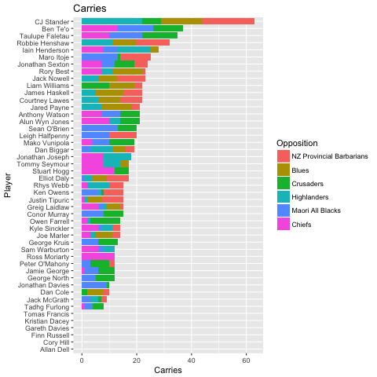
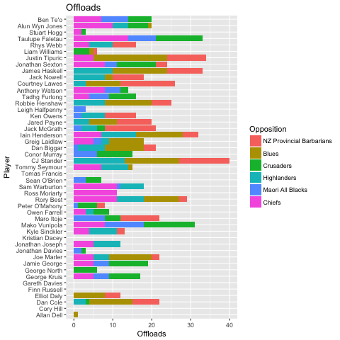
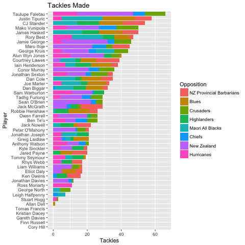

Performance data from the 2017 Lions Tour to New Zealand
Data scraped from lionsrugby.com

Dataset maintained in [data/lions_tour_performance.csv](blob/master/data/lions_tour_performance_data.csv) 

Available Fields 

Variable Name | Type | Description
------------ | ------------- | -------------
Position | Number | Shirt Number
Player | String | Full Player Name
Metres_Gained | Number | 
Carries | Number | 
Passes | Number | 
Tackles | Number | 
Missed_Tackles | Number | 
Turnovers_Won | Number | 
Turnovers_Conceded | Number | 
Defenders_Beaten | Number | 
Try_Assists | Number | 
Offloads | Number | 
Clean_Breaks | Number | 
Lineouts_Won | Number | 
Lineouts_Stolen | Number | 
Match_Data_File | String | File name of original HTML data file
Opposition | String | Opposition Team Name
Tour_Match | String | Specific tour match that statistics are from (e.g 'M1' for first game on tour, 'M7' for first test match)

